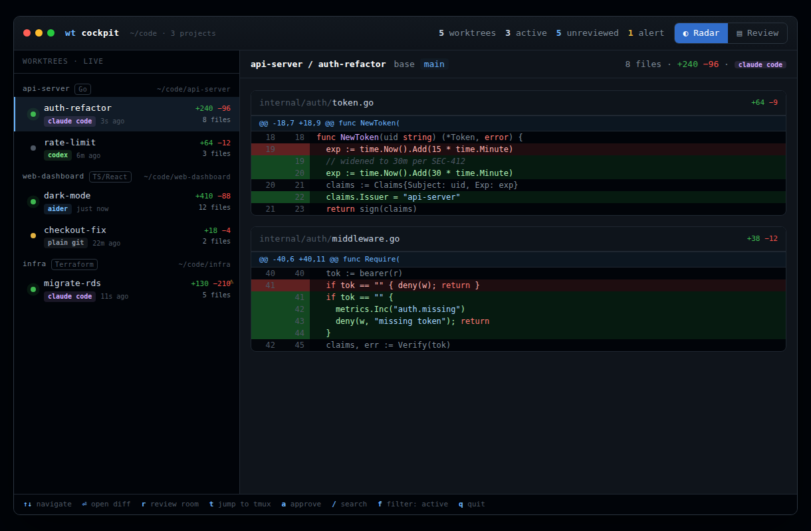

# wt cockpit

[](https://github.com/navbytes/wt-cockpit/actions/workflows/ci.yml)
[](go.mod)
[](LICENSE)

A read-only, agent-agnostic **diff cockpit**: watch, catch mistakes in, and review the
diffs of many git worktrees across many projects while AI agents (Claude Code, Codex,
Aider, or plain git) work in parallel. It never launches or controls agents — it only
reads git and the filesystem, which is exactly what lets one tool span every setup at once.



Built test-first: the engine/daemon, a terminal client (`wt` + a full-screen TUI), and
the web reading room below are all here. See [ROADMAP.md](ROADMAP.md) for what's next,
and [docs/](docs/README.md) for the design history (why a viewer, why a daemon, why Go).

## Architecture

The engine is a headless daemon (`wtd`); every frontend is a thin client over a small
HTTP API on a Unix socket. This is the anti-bottleneck decision: the TUI, the web
reading room, and `wt menubar` (a SwiftBar/xbar plugin emitter) are all clients of the
same engine, and the language or git library can be swapped without touching them.

```
frontends (thin clients)          wt (CLI/radar/TUI) · web · menu-bar
        │  events (SSE)  │  commands (JSON/HTTP)
        ▼                ▼
wtd — daemon/engine     discovery · registry+bus · diff · guardrails · review store
        │  GitBackend interface (swappable)
        ▼
git access              git CLI now  →  libgit2 / gitoxide later
```

Everything the design put behind an interface has a stdlib implementation now and a
richer drop-in later:

| Concern | Interface | MVP impl | Future drop-in |
|---|---|---|---|
| git access | `gitbackend.Backend` | shell out to `git` | libgit2 / gitoxide |
| change detection | `watcher.Watcher` | `Poller` (periodic) | fsnotify, git-state-first |
| persistence | `store.Store` | JSON file | SQLite |
| frontend | HTTP/SSE client | `wt` ANSI radar | Bubble Tea TUI, web |

## Packages

- `internal/model` — transport-agnostic domain types.
- `internal/diffparse` — pure unified-diff → structured hunks/lines parser.
- `internal/guardrail` — declarative glob + threshold + RE2/entropy rule engine
  (+ `**` globber, per-repo `.wtcockpit.toml` pack resolution).
- `internal/notify` — desktop notifier (`osascript`/`notify-send`, fixed argv only —
  no shell), coalesced and cooled down.
- `internal/gitbackend` — `Backend` interface + git-CLI impl (incl. untracked files).
- `internal/discovery` — scan roots for repos (skips linked worktrees + heavy dirs).
- `internal/store` — review/comment persistence (JSON).
- `internal/registry` — in-memory state + pub/sub event bus, emits deltas not full state.
- `internal/watcher` — refresh driver (`Poller`).
- `internal/engine` — orchestration + query/command surface.
- `internal/client` — shared thin HTTP/SSE client (the only talker to `wtd`; `wt`'s CLI
  and TUI both sit on top of it).
- `internal/tui` — the full-screen Bubble Tea cockpit (`wt tui`): Radar + Review views,
  virtualized diff pane, chroma syntax highlighting.
- `internal/web` — the opt-in web reading room: server-rendered `html/template` pages
  over the same API, SSE-driven live fragments, inline comment threads.
- `cmd/wtd` — daemon: engine + HTTP/SSE over a Unix socket (+ optional TCP, optional
  loopback web listener).
- `cmd/wt` — terminal client: `ls`, `watch`, `diff`, `review`, `approve`, `refresh`, `tui`,
  `comments`, `comment`, `resolve`, `open`, `rules`, `menubar`.

## Install & run

```sh
go install github.com/navbytes/wt-cockpit/cmd/wtd@latest
go install github.com/navbytes/wt-cockpit/cmd/wt@latest
# or from a checkout:
make build   # → bin/wtd, bin/wt

# start the daemon over one or more roots (uses fsnotify watcher by default)
wtd -root ~/code -interval 1s &

# the client (defaults to ~/.wtcockpit/wtd.sock; override with WTD_SOCKET)
wt                          # on a terminal: full-screen TUI; piped/redirected: same as wt ls
wt tui                      # explicit: always the full-screen TUI
wt ls                       # radar: all worktrees, most-recently-changed first
wt watch                    # live radar, re-renders on every change (SSE)
wt diff <id>                # a worktree's structured diff
wt review <id> <file>       # mark a file reviewed (--off to unmark)
wt approve <id>             # merge worktree→base & remove it (gated)
wt refresh                  # force a rescan
wt comments <id> [--json]   # list comments left on a worktree (agents: see docs/agents.md)
wt comment <id> <file> <line> <body...>   # leave one (line 0 = file-level)
wt resolve <id> <comment-id>              # mark a comment addressed
```

`wtd -tcp 127.0.0.1:7799` additionally serves the same API over TCP (bind to a Tailscale
interface for remote/phone viewing).

`wtd -web 127.0.0.1:7788` additionally serves the [reading room](#reading-room-web-ui), a
browser UI, on loopback only — see below.

## Terminal UI (`wt tui`)

The daily-driver view: a live sidebar (Radar) plus a virtualized, syntax-highlighted
unified diff, and a Review mode for marking files reviewed and approving a merge —
all over the same daemon API the CLI uses (thin client, zero git logic; the only
`exec` it ever does is jumping to a `tmux` pane).

```
wt              # on a terminal: opens the TUI (the "daily driver" default)
                # piped/redirected (wt | less, wt > out.txt, cron, CI): prints the
                # same text radar as `wt ls` — scripts and pipelines keep working
wt tui          # explicit: always opens the TUI
wt ls           # explicit: always prints the text radar, even on a terminal
```


*(placeholder — a real terminal screenshot goes here once one's captured; the mock
this was built from lives at [docs/ux/mock.html](docs/ux/mock.html))*

Colors degrade automatically — truecolor → 256 → 16 — and `NO_COLOR=1` (or a
non-color `TERM`) renders plain, uncolored text; no flags needed either way.

### Keybindings

Synced by hand from [`internal/tui/keys.go`](internal/tui/keys.go) — update both if a
binding changes.

Radar view:

| Key | Action |
|---|---|
| `↑`/`k`, `↓`/`j` | move selection in the sidebar |
| `⏎` | focus the diff pane (scroll keys below act on it) |
| `esc` | back: diff focus → sidebar; clears an active search/filter first if one is set |
| `r` | open Review for the selected worktree |
| `t` | jump to the tmux pane `cd`'d into this worktree |
| `a` | approve & merge — opens the confirm modal |
| `/` | fuzzy-substring search across repo/name/branch |
| `f` | toggle "active worktrees only" filter |
| `R` | force refresh |
| `q`, `ctrl-c` | quit |

Review view:

| Key | Action |
|---|---|
| `j`/`k` | next / previous **file** |
| `space` | toggle reviewed on the file under the cursor |
| `a` | approve & merge — same confirm modal |
| `esc` | back to Radar |
| `↑`/`↓`, `ctrl-d`/`ctrl-u`, `pgup`/`pgdn`, `g`/`G` | fine-scroll the diff |
| `t`, `q` | same as Radar |

Diff-pane scrolling (either view, once the pane is focused): `j`/`k` line,
`ctrl-d`/`ctrl-u` half page, `pgup`/`pgdn`/`space` page, `g`/`G` top/bottom, `[`/`]`
previous/next file, `o` expand/collapse the file under the cursor (very large diffs
and lockfiles collapse by default).

## Reading room (web UI)

Off by default — opt in with `wtd -web 127.0.0.1:7788` (or `web = "127.0.0.1:7788"` in
config.toml). It's a second listener on the same daemon/engine, a side-by-side
alternative to the TUI's unified diff for a deliberate, bigger-screen review pass:

```sh
wtd -root ~/code -web 127.0.0.1:7788 &
wt open <id>       # opens $BROWSER (or the platform's default opener) to that worktree
```

`wt open` reads the daemon's actual bound address (correct even with an ephemeral
`-web 127.0.0.1:0`) and launches straight into `/wt/<id>`; without `-web` running it
errors with the exact flag to add. The index page (`/`) lists every worktree the same
way the TUI's sidebar does, live over SSE.

No Node toolchain, no client-side framework: pages are `html/template` (escaped
server-side, the same discipline the TUI applies to hostile diff content) plus one
small vanilla-JS file for POSTs, live SSE refresh, and fragment swaps. **Loopback only**
— the daemon refuses to bind anywhere else (`-web 0.0.0.0:...` exits with an error
naming the restriction); remote access is a later phase. Being loopback doesn't mean
private: any local user/process can reach it, same trade-off as `-tcp` today.

The room mirrors the TUI's Review view: side-by-side hunks, a file checklist with
per-file reviewed toggles, a progress bar, and the same gated approve button. On top of
that it adds **inline comments** — click a line's gutter (or a file's "comment" button
for file-level feedback) to leave a note; threads render right under the file's header,
with author/age and amber "stale" / grey "orphaned" badges when the commented file has
since changed or left the diff. Everything live-updates over SSE: a second tab, the CLI,
or an agent resolving/adding a comment shows up here without a reload. A new
danger-severity guardrail hit also pops a transient toast (top-right, any page) the
moment it trips — the same SSE stream, no polling.

This is also the other half of the review→agent loop: comments left here (or via
`wt comment`) are what an agent consumes to act on feedback and close the loop with
`wt resolve`. See **[docs/agents.md](docs/agents.md)** for the full agent-integration
guide — the frozen `wt comments --json` schema, stale/orphaned semantics, and exit codes.

## Configuration

Config file `~/.config/wtcockpit/config.toml` (or `$XDG_CONFIG_HOME/wtcockpit/config.toml`)
defines roots, per-repo base branch overrides, guardrail rules, and daemon options.
Precedence: explicit flags > config file > built-in defaults. Malformed TOML is a fatal error.

Example:
```toml
roots = ["~/code", "~/work"]
base = "main"
watch = "fsnotify"          # or "poll" to disable file watching
interval = "2s"

[repos."/home/user/code/api"]
base = "develop"            # per-repo override

[[rules]]
name = "example-rule"
severity = "warn"
path_glob = "**/*.yaml"
```

See [docs/config.example.toml](docs/config.example.toml) for the full reference.
Use `-config /path/to/config.toml` to specify a custom location, or `-watch fsnotify|poll`
to override the watcher backend at runtime.

## What the engine does each refresh

Discover repos under the roots → expand worktrees via git → for each, diff against its
base (merge-base of `base..HEAD` through the working tree, **including untracked files**)
→ parse into structured hunks → evaluate guardrails → compute state (active/dirty/idle)
→ upsert into the registry, which emits a delta only when something actually changed.
Review state resets automatically when a worktree's diff content changes.

## Approve & merge (the write path)

`Approve` is the only mutating operation, and it is deliberately gated. It refuses
unless every file in the worktree's diff is marked reviewed **and** the worktree is
clean (all work committed — you cannot merge uncommitted or untracked changes). It
then merges the worktree's branch into the base branch (in whichever worktree has
base checked out) and removes the worktree. If the merge hits a conflict it is
aborted, leaving the base branch untouched — a failed approve never corrupts main.

Review marks survive commits: only files whose content actually changed flip back to
unreviewed, so committing work no longer resets the review state of other files.

## Tests

Test-first throughout; 39 tests, green under `-race`:

```sh
go test ./...
go test -race -count=1 ./...
```

Two behaviours were caught by tests and fixed during development: untracked files were
missing from diffs (agents create new files — now synthesized read-only via
`git diff --no-index`), and content edits to already-dirty files weren't detected (the
"changed?" decision is now keyed on the diff hash, correct under polling).

## Guardrails

Declarative rules (`internal/guardrail`) — globs, thresholds, and RE2 patterns, never
code — evaluated once per refresh. `Compile` validates the whole set at load (bad
severity, a typo'd condition, a non-compiling pattern), so a mistake fails loudly at
startup rather than silently never firing. Twelve rules ship by default:

| Rule | Sev | Catches |
|---|---|---|
| `touches-migrations` | danger | edits under `migrations/` |
| `secrets-pattern` | danger | AWS/GitHub/Slack/OpenAI/Google token shapes, or a PEM private key, in added lines |
| `ci-workflow-delete` | danger | a `.github/workflows/*` file deleted |
| `secrets-entropy` | warn | a high-entropy (≥4.8 bits/char) added token, 32+ chars |
| `edits-ci` | warn | edits to `.github/workflows/*` |
| `lockfile-churn` | warn | 200+ line churn in a lockfile/snapshot |
| `deps-manifest-changed` | warn | `go.mod`/`package.json`/`Cargo.toml` touched |
| `large-deletion` | warn | one file net-deletes 80+ lines |
| `net-negative` | warn | a worktree deletes 3x more than it adds |
| `big-blast-radius` | warn | 25+ files changed |
| `huge-churn` | warn | 1,500+ total lines changed |
| `binary-added` | warn | a new binary file |

A rule matches per-file (`path_glob`/`path_globs`, `exclude_globs`, `status`, `binary`,
`min_net_deleted`, `min_changed_lines`, `added_pattern`, `min_token_entropy` +
`min_token_len`) or worktree-wide (`min_delete_add_ratio`, `min_files_changed`,
`min_total_changed`) — never both. Content conditions (`added_pattern`, entropy) scan
only *added* lines, skip binaries, and never echo the matched text back: a hit names
the rule, file, and line, never the secret itself — true of the JSON API, the SSE
stream, and the desktop notifications below, too. See
[docs/config.example.toml](docs/config.example.toml) for the full field reference.

`secrets-entropy`'s 4.8 bits/char default is calibrated to actual random secrets, not
every long token — a 32-40 char realistic base64 secret (e.g. an AWS secret access
key) sometimes falls short of 4.8 in practice, and that's intentional: lowering the
threshold to catch more of those trades away real detections for false-positive
notification fatigue on ordinary base64/hex/UUID content, the exact failure mode this
rule's `exclude_globs` and hex/UUID entropy ceiling already guard against. Known-shape
secrets (AWS/GitHub/Slack/OpenAI/Google tokens, PEM keys) are the `secrets-pattern`
rule's job; `secrets-entropy` is a best-effort net for everything else long and
random-looking, not a guarantee of catching every long token.

### Per-repo overrides: `.wtcockpit.toml`

A checked-in `.wtcockpit.toml` at a repo's root tunes that repo's rules without
touching your own `config.toml`:

```toml
# .wtcockpit.toml — reviewed and merged like any other file
disable_rules = ["net-negative"]

[[rules]]
name = "touches-payments"
severity = "danger"
path_globs = ["internal/payments/**"]
message = "touches payment code"

[[rules]]                 # same name as a global/default rule -> REPLACES it
name = "large-deletion"
severity = "warn"
min_net_deleted = 200      # this repo deletes a lot; retune, don't disable
```

Effective rules = the global set, minus `disable_rules`, plus the pack's own
`[[rules]]` (a name match replaces the global rule in place; anything new is
additive). **Trust boundary:** the pack is read only from the repo's *main* worktree,
never from the feature worktree being diffed — an agent editing its own worktree
cannot weaken the guardrails judging it; that edit is just another diff line, inert
until merged. A malformed pack fails closed to the global rules (one log line, never a
crash). `wt rules <id>` shows the fully-resolved set with provenance
(`default`/`global`/`pack`) and the pack's own path/status — one command that answers
"why did/didn't this fire".

### Cookbook

Protected-path deletes, beyond the shipped `ci-workflow-delete` default:

```toml
[[rules]]
name = "protected-path-delete"
severity = "danger"
status = "deleted"
path_globs = ["internal/auth/**", "**/migrations/**"]
message = "deletes a file under a protected path"
```

A sharper "new dependency" signal than the shipped `deps-manifest-changed` (which flags
the manifest touched at all, any edit):

```toml
[[rules]]
name = "new-go-dependency"
severity = "warn"
path_glob = "go.mod"
added_pattern = '^\t[\w./-]+ v'   # a genuinely new `require` line, not a version bump
message = "adds a new Go dependency"
```

## Notifications

The daemon can nudge you on a danger-severity hit without watching a screen: an
`osascript`/`notify-send` desktop notification (title `wt-cockpit — repo/name`, body
the hit's message). No shell is ever involved — content only travels as trailing argv
elements, never concatenated into a command string. Bursts coalesce (a 5s window groups
several hits into one notification per worktree; more than 3 worktrees tripping at once
collapses to a single summary) and a given rule+file re-notifies at most once per 10
minutes. On by default; configure in `config.toml`:

```toml
[notifications]
enabled  = true      # default true
severity = "danger"  # "danger" (default) | "warn" (= warn + danger)
cooldown = "10m"
```

macOS may prompt for a one-time notification permission the first time `osascript`
fires — grant it once and it's silent after that. There's no in-app mute or quiet
hours: your OS's own Do Not Disturb (macOS Focus, GNOME/KDE DND) is the mute button;
`enabled = false` is the permanent opt-out. `wt status` shows the notifier's resolved
state (`osascript` / `notify-send` / `disabled (config)` / `unavailable (no notifier
binary)`). `wt watch` gets its own lightweight signal too — a terminal bell + OSC 9
popup (honored by iTerm2/kitty/WezTerm, harmlessly ignored elsewhere) on a danger hit,
throttled to once per 5s.

## Menu bar

`wt menubar` prints [SwiftBar](https://github.com/swiftbar/SwiftBar)/
[xbar](https://github.com/matryer/xbar) plugin text and exits — a thin emitter against
the same API every other `wt` command uses, not a native app (no cgo, no systray
dependency, still one static binary):

```
⚠1 ✓9/12
---
api-server/auth-refactor — 1 danger | href=http://127.0.0.1:7788/wt/<id>
web/checkout-flow — 3 files unreviewed | href=…
---
Open cockpit | href=…
```

The title is the danger-worktree count and reviewed/total files across the whole
fleet; rows are worktrees actually needing attention (a danger hit, or unreviewed
files) and link straight into the reading room when `wtd -web` is running (plain
labels otherwise). With `wtd` unreachable it renders `wt ◦` instead of failing the
plugin. To install, drop a two-line wrapper into whichever folder you've configured as
your plugins directory (SwiftBar/xbar prompt for one on first launch):

```sh
cat > "$PLUGIN_DIR/wt-cockpit.5m.sh" <<'EOF'
#!/bin/sh
exec wt menubar
EOF
chmod +x "$PLUGIN_DIR/wt-cockpit.5m.sh"
```

(`.5m.` in the filename sets the refresh interval — SwiftBar/xbar both read it the same
way; pick whatever cadence suits you.)

## Not yet built (deliberately, next phases)

A SQLite store (behind the existing `Store` interface — no engine rework needed, same
pattern the Bubble Tea TUI and the fsnotify watcher already followed) and remote/auth'd
access — see [ROADMAP.md](ROADMAP.md) for the full path.
