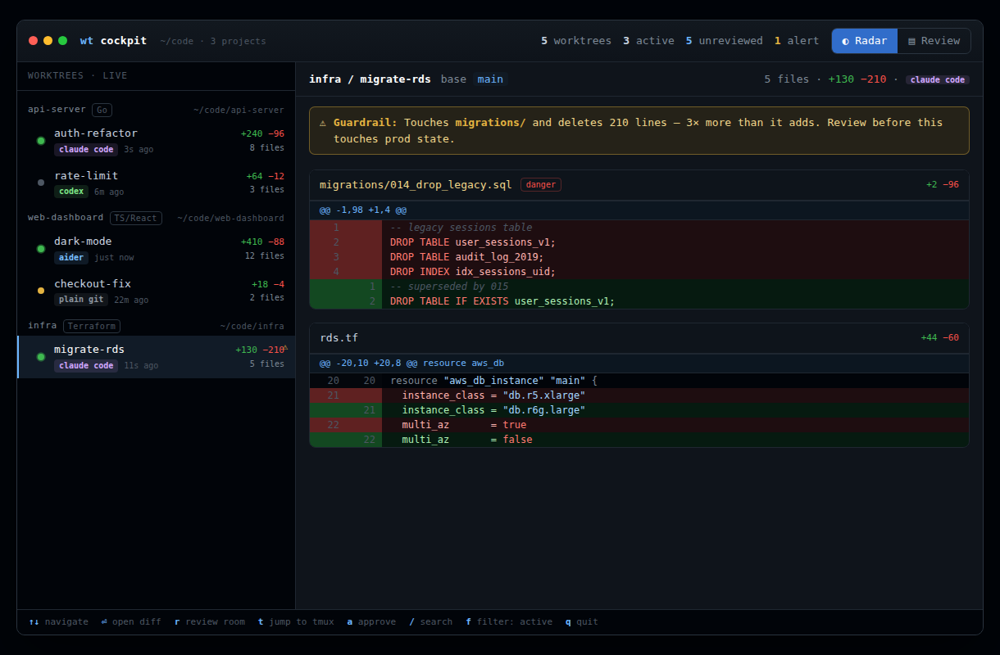
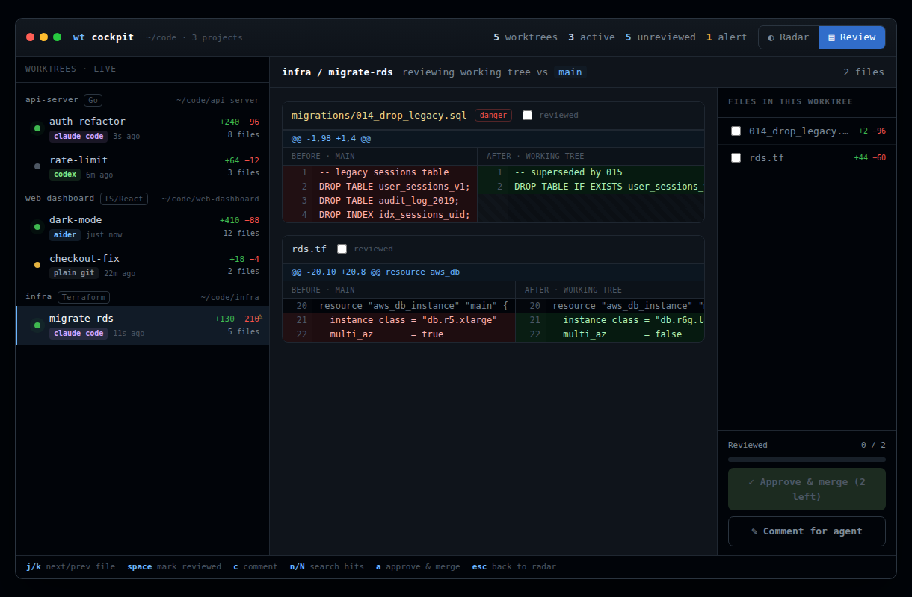

# Design docs

These are the working documents the project grew out of, kept as a record of *why*
it is shaped the way it is.

- **[01-brainstorm.md](01-brainstorm.md)** — the landscape survey (orchestrators
  vs. worktree managers vs. diff TUIs), the gap analysis, and the core product
  decision: a read-only, agent-agnostic viewer, deliberately *not* an orchestrator.
- **[02-stack-decision.md](02-stack-decision.md)** — the architecture ADR: the
  daemon/frontend split, Go-vs-Rust reasoning, per-layer library picks, and the
  named future bottlenecks with their mitigations. The "won't-regret-it checklist"
  at the end is effectively the project's constitution.
- **[ux/mock.html](ux/mock.html)** — the interactive UX mock (open in a browser):
  the Radar and Review views the TUI (v0.3) and web reading room (v0.4) implement.

## UX mock screenshots

**Radar** — glanceable live view across projects/worktrees:

**Guardrail tripped** — an agent gutting a migration file surfaces itself:

**Review** — side-by-side reading room with per-file review gating the merge:

For where this is all headed, see the top-level [ROADMAP.md](../ROADMAP.md).
